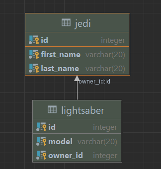

# Каркас на Spring MVC + Spring JDBC

## Локальный запуск


### Подключить модуль к БД



Обновить файл dispatcher-servlet.xml
```
 <bean id="dataSource" class="org.springframework.jdbc.datasource.DriverManagerDataSource">
        <property name="password" value="postgres"/>
        <property name="url" value="jdbc:postgresql://localhost:5432/postgres"/>
        <property name="username" value="postgres"/>
        <property name="driverClassName" value="org.postgresql.Driver"/>
  /bean>
```
        
Накатить на БД патч:
```
create table jedi (
    id serial primary key,
    first_name varchar(20),
    second_name varchar(20)
);

create table lightsaber
(
    id serial,
    model varchar(20),
    owner_id int,
    constraint fk_owner_id foreign key(owner_id) references jedi(id)

)
```
### Собрать war
```
./gradlew springmvc:war
```
    
Добавить конфиг запуска через томкат в идее и задеплоиить артефакт
